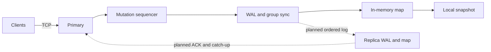

# DistributeDB

DistributeDB is a single-primary key-value database project for studying durable storage, crash recovery, concurrent TCP clients, and primary-replica replication. The core implementation is in progress; it is not production ready.

## Status

Phases 1–4 of the [Statement of Work](docs/SOW.md) have implementations and automated tests: the local key-value engine, a checksummed write-ahead log (WAL), process-restart recovery, a TCP client/server, and local snapshots. The server accepts client writes on one node. **Replication, replica catch-up, cluster failure tests, and the benchmark harness are not implemented yet.**

The [technical design](docs/Technical-Design.md) describes the intended distributed behavior and marks choices added beyond the SOW. The [filesystem decision record](docs/ADR-001-Language-and-Filesystem.md) identifies the initial Linux/ext4 profile. Some design details are still provisional until their implementation tests pass.

## Scope

The required key-value operations are `SET`, `GET`, `DELETE`, and `EXISTS`. The core goals are persistent state through WAL and snapshots, concurrent client access, ordered primary-to-replica mutation delivery, replica catch-up after downtime, explicit durability and consistency semantics, failure tests, observability, and reproducible benchmarks.

The initial scope excludes SQL, distributed transactions, multi-primary consensus, Raft, automatic failover, sharding, production authentication, and encryption at rest. One disk-aware index (B+ tree or LSM tree) is optional after the core phases are sound.

## Architecture



The server uses one mutation sequencer and a bounded write queue. In `fsync` mode, a write is appended with a group footer, synced, and applied before the server returns `OK`. Reads use the current applied map. The sequencer currently holds the database write lock during the sync, so read latency can include a WAL flush; this is a known performance trade-off to measure in Phase 7. The local in-memory REPL does not persist data.

Asynchronous replication is planned. A future primary `OK` will mean **local** durability, not replica durability. A disconnected replica may lag; replica reads, if exposed, may be stale. If a connection drops before a client receives `OK`, the write outcome is unknown and the client must reconcile before retrying an operation whose repetition matters.

## Run the current server

Use Rust 1.92 or newer on the [supported filesystem profile](docs/ADR-001-Language-and-Filesystem.md). Each server needs its own data directory. The demo listener is unauthenticated and should remain on loopback.

```sh
cargo build --offline
cargo test --offline --all-targets
cargo run -- serve --addr 127.0.0.1:5555 --data ./data/primary
```

In another terminal:

```sh
printf 'SET user:123 Aaron\nGET user:123\n' | cargo run -- client --addr 127.0.0.1:5555
```

The `serve` process exits after `shutdown` on stdin or EOF. Run `cargo run` without a subcommand for the original **in-memory** REPL. Snapshot publication and recovery are exercised through the library API and tests; an operator CLI for snapshot scheduling is still pending.

## Roadmap and verification

| Phase | State |
|---|---|
| 1 — Local key-value engine | Implemented and tested. |
| 2 — Persistent WAL | Implemented with group commit, checksums, simulated power-loss tests, and restart tests. |
| 3 — Networking | TCP server/client and concurrent request tests implemented. |
| 4 — Snapshots | Local publication, reload validation, WAL reclamation, and recovery tests implemented. |
| 5 — Replication | In progress: static node identity and recovery-generation prerequisites. Ordered stream, ACKs, and lag remain. |
| 6 — Failure recovery | Planned: reconnect, WAL and snapshot catch-up, kill/restart cluster tests. |
| 7 — Performance engineering | Planned: benchmark harness, workload mixes, resource and latency measurements. |
| 8 — Advanced storage | Optional after core acceptance. |

CI runs formatting, Clippy, Rust tests, and documentation checks. Passing these checks supports the tested scenarios; it does not prove power-loss durability on physical hardware. The planned workload mixes are 90/10, 50/50, and 10/90 GET/SET. No benchmark results are published yet.

See [development setup](docs/Development-Setup.md) and [recovery notes](docs/recovery.md) for test and operator details.

## License

MIT; see [LICENSE](LICENSE).
