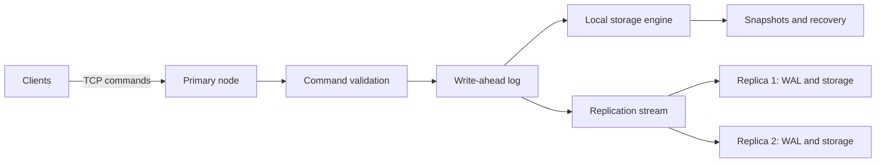

# DistributeDB

DistributeDB is a planned fault-tolerant distributed key-value database. The project is intended to explore persistent storage, write-ahead logging, crash recovery, concurrent TCP clients, primary-replica replication, and measurable failure behavior.

## Overview

The initial implementation targets a networked key-value store with one primary node and one or more replicas. Clients will send operations to the primary; the primary will maintain an ordered mutation log, persist writes, and replicate them to followers. Snapshots and WAL replay will support restart recovery, while replica catch-up will handle temporary disconnection.

The project prioritizes correctness, explicit durability and consistency semantics, failure testing, and reproducible benchmarks over feature breadth. It is an engineering project for studying how storage, concurrency, networking, and replication interact in one system.

## Project status

**Status: Phase 1 implemented (local, in-memory key-value engine).** The Phase 1 local engine works: an in-memory `SET`/`GET`/`DELETE`/`EXISTS` engine, a command parser, and a local stdin REPL, all covered by unit tests. The distributed database as a whole is still early: there is no persistent WAL, TCP server, client, replication, snapshot, benchmark result, or runnable cluster in this repository yet (those are phases 2 and later).

The repository currently contains the [Statement of Work](docs/SOW.md), a [technical design and implementation plan](docs/Technical-Design.md), a [language and filesystem decision record](docs/ADR-001-Language-and-Filesystem.md), and [development setup notes](docs/Development-Setup.md). The design records proposed implementation choices; its byte formats and guarantees still require tests during implementation.

## Goals

The SOW defines these core goals:

- A minimal `SET`, `GET`, `DELETE`, and `EXISTS` key-value interface.
- Persistent state using a write-ahead log, crash recovery, and snapshots.
- A TCP client/server interface that handles concurrent clients, partial messages, malformed commands, disconnects, and shutdown.
- A single primary that orders mutations and replicates them to one or more followers.
- Replica catch-up from missing WAL entries, with snapshot transfer when required WAL has been compacted.
- Clear documentation of local durability, asynchronous replication, and potentially stale replica reads.
- Automated unit, integration, and failure-injection tests, plus observable replication lag and latency.
- Reproducible read-heavy, balanced, and write-heavy benchmark workloads.

## Non-goals

The initial scope excludes full SQL compatibility, distributed transactions, multi-primary consensus, a complete Raft implementation, automatic failover, sharding, a query optimizer, joins, secondary indexes, schema migrations, geographic replication, production-grade authentication, and encryption at rest. The SOW lists several of these as possible later extensions, not commitments for the core build.

## Planned architecture

Clients will initially connect to a manually configured primary. The primary will validate commands, append mutations to its WAL, update its local storage engine, and replicate the ordered log. Replicas will maintain their own state and track the last applied log sequence number (LSN). On restart, a node will load a snapshot and replay later WAL entries. A replica that falls behind will request missing entries or, if they are no longer available, a snapshot.



The first storage engine may use an in-memory hash map backed by persistent files. The SOW allows asynchronous replication initially; this means a primary acknowledgment and a replica acknowledgment are different events. The technical design specifies proposed boundaries for those events, but they are not implemented or verified yet. There is no automatic leader election or primary promotion in the core scope.

## Planned interface

| Command | Intended behavior |
|---|---|
| `SET key value` | Store or replace a value. |
| `GET key` | Retrieve a value. |
| `DELETE key` | Remove a key. |
| `EXISTS key` | Check whether a key is present. |

The SOW gives these command names but does not freeze a wire protocol, response encoding, or edge-case semantics. Those details are proposed in the technical design and will be validated during implementation. Optional commands and transactions are not required for the core system.

## Phase 3 networking

Phase 3 puts the durable Phase 2 engine behind a TCP server and a matching client.

- **Binary wire protocol (Technical-Design §4.1).** Each message is length-prefixed: `body_len:u32 | body`, where `body = version:u8 | kind:u8 | payload`. All integers are little-endian and `version = 1`. Request kinds are `SET`, `GET`, `DELETE`, `EXISTS`, and `STATS`; responses carry a status code (`OK`, `NOT_FOUND`, `BAD_REQUEST`, `UNSUPPORTED_VERSION`, `RESOURCE_EXHAUSTED`, `UNAVAILABLE`, and others) plus a data field. `body_len` is bounded to `2..=1_048_576` bytes and is rejected before any buffer is allocated. `STATS` returns bounded `name=value` lines with `version` first.
- **Concurrency (Technical-Design §5).** An acceptor thread spawns one worker thread per connection, up to `max_connections` (default 128); excess connections are rejected. Reads (`GET`/`EXISTS`/`STATS`) are served directly under a shared read lock. Writes (`SET`/`DELETE`) are submitted to a single mutation sequencer thread over a bounded queue; the sequencer batches up to 64 mutations / 8 MiB into one WAL group commit (one `fsync`), applies them, and releases each waiting connection. A full queue returns `RESOURCE_EXHAUSTED`. All writes go through the Phase 2 durable path, so there is no second durability mechanism.
- **Ports.** Clients connect to a single client port (the demo default is `127.0.0.1:5555`). A separate replication port is a later phase (Phase 5) and does not exist yet.
- **Loopback-only, unauthenticated demo.** The server binds `127.0.0.1` and performs no authentication or encryption. It is a local demonstration, not a production listener.
- **Disconnect / retry limitation (Technical-Design §4.2).** A write is durable once the server returns `OK`. If the connection drops before the client reads that `OK`, the outcome is **unknown**: the mutation may or may not have committed. There is no request de-duplication (no exactly-once delivery), so a client that retries may apply the mutation again. `SET` and `DELETE` are idempotent, so a naive retry is safe for those operations only.

Try it locally (loopback):

```sh
cargo run -- serve --addr 127.0.0.1:5555        # in one terminal
printf 'SET user:123 Aaron\nGET user:123\n' | cargo run -- client --addr 127.0.0.1:5555
```

With no subcommand, `cargo run` still launches the original local in-memory REPL.

## Roadmap

| Phase | Planned outcome |
|---|---|
| 1 — Local key-value engine | **Implemented.** In-memory `SET`/`GET`/`DELETE`/`EXISTS` operations, a line parser, a local stdin REPL, and unit tests. |
| 2 — Persistent WAL | Durable writes, sequence numbers, and restart recovery. |
| 3 — Networking | **In progress.** TCP server/client, a binary wire protocol, a mutation sequencer with WAL group commit, and concurrent connections. |
| 4 — Snapshots | Snapshot creation, loading, and WAL rotation or truncation. |
| 5 — Replication | Primary and replicas with ordered log delivery and acknowledgments. |
| 6 — Failure recovery | Reconnect, WAL catch-up, snapshot-based recovery, and kill/restart tests. |
| 7 — Performance engineering | Benchmark harness, latency and throughput measurements, and profiling. |
| 8 — Optional advanced storage | One disk-aware index, B+ tree or LSM tree, only if the core is sound. |

Phase 1 is implemented and tested; phases 2 through 8 are still planned. Progress will be recorded here as implementation and tests are added; this table does not imply any later phase is complete.

## Testing and benchmarking plan

The SOW calls for tests of parsing, WAL serialization, snapshots, networking, concurrency, replication, and recovery. Failure tests will kill and restart nodes, interrupt replication, and examine incomplete WAL tails. The key durability acceptance condition is that every acknowledged durable write survives a supported process-crash recovery scenario.

Planned benchmark mixes are 90% reads / 10% writes, 50% reads / 50% writes, and 10% reads / 90% writes. Results will report throughput, latency percentiles, CPU, memory, and storage usage, with raw results under `benchmarks/results/` when a benchmark tool exists. **No benchmark results exist yet.**

## Getting started

The Phase 1 local engine is a standard Rust (edition 2021) crate built with Cargo and the standard library only. From the repository root:

```sh
cargo build   # compile the library and the REPL binary
cargo test    # run the unit tests for the parser, engine, and dispatch layer
cargo run     # start the local stdin REPL
```

The REPL reads one command per line, executes it against a single in-memory engine, and prints a human-readable response. `SET` and `DELETE` print `OK`, `GET` prints the stored value (or `NOT_FOUND` for a missing key, which is distinct from an empty stored value), and `EXISTS` prints `true` or `false`. Malformed input prints a `BAD_REQUEST` message to stderr and the loop continues. The REPL exits on end-of-input. For example, piping commands in:

```sh
$ printf 'SET user:123 Aaron\nGET user:123\n' | cargo run --quiet
OK
Aaron
```

This engine is local and in-memory only: nothing is persisted, and there is no networking. For scope and design, start with the [SOW](docs/SOW.md), then read the [technical design](docs/Technical-Design.md) for proposed interfaces and failure invariants. The [setup notes](docs/Development-Setup.md) describe the development environment. Persistent WAL, the TCP server/client, replication, and snapshots are not implemented yet; those commands will be added when their phases land.

The repository's documentation CI checks that the design documents are present and whitespace-clean; it does not yet run the Rust test suite.

## Contributing

Design review and corrections are useful at this stage, particularly for WAL and snapshot crash boundaries, replication catch-up, and testable acceptance criteria. New implementation work should preserve the SOW's scope, identify whether a behavior is source-derived or a new design choice, and add tests for its stated guarantees. Please avoid claiming a feature is complete until it is implemented and verified.

## License

MIT; see [LICENSE](LICENSE).
