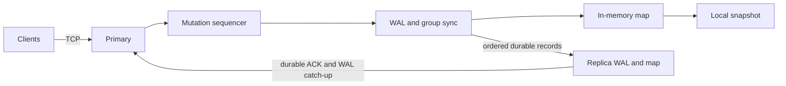

# DistributeDB

DistributeDB is a single-primary key-value database project for studying durable storage, crash recovery, concurrent TCP clients, and primary-replica replication. The core implementation is in progress; it is not production ready.

## Status

Phases 1–4 of the [Statement of Work](docs/SOW.md) have implementations and automated tests: the local key-value engine, a checksummed write-ahead log (WAL), process-restart recovery, a TCP client/server, and local snapshots. Phase 5 adds an asynchronous, ordered primary-to-replica stream with locally durable replica ACKs and reconnect from retained WAL. Phase 6 adds explicit snapshot rebootstrap and a process kill/restart harness. **The benchmark harness is implemented; a first set of [CI-runner results](benchmarks/results/README.md) is published.**

The [technical design](docs/Technical-Design.md) describes the intended distributed behavior and marks choices added beyond the SOW. The [filesystem decision record](docs/ADR-001-Language-and-Filesystem.md) identifies the initial Linux/ext4 profile. Some design details are still provisional until their implementation tests pass.

## Scope

The required key-value operations are `SET`, `GET`, `DELETE`, and `EXISTS`. The core goals are persistent state through WAL and snapshots, concurrent client access, ordered primary-to-replica mutation delivery, replica catch-up after downtime, explicit durability and consistency semantics, failure tests, observability, and reproducible benchmarks.

The initial scope excludes SQL, distributed transactions, multi-primary consensus, Raft, automatic failover, sharding, production authentication, and encryption at rest. One disk-aware index (B+ tree or LSM tree) is optional after the core phases are sound.

## Architecture



The server uses one mutation sequencer and a bounded write queue. In `fsync` mode, a write is appended with a group footer, synced, and applied before the server returns `OK`. Reads use the current applied map. The sequencer currently holds the database write lock during the sync, so read latency can include a WAL flush; this is a known performance trade-off to measure in Phase 7. The local in-memory REPL does not persist data.

Asynchronous replication sends only locally durable records. A primary `OK` means **local** durability, not replica durability. A disconnected replica may lag. If a connection drops before a client receives `OK`, the write outcome is unknown and the client must reconcile before retrying an operation whose repetition matters. A replica behind the retained WAL can install a snapshot only if it was explicitly provisioned to permit rebootstrap; see [replication and recovery](docs/replication.md) for limits.

## Run the current server

Use Rust 1.92 or newer on the [supported filesystem profile](docs/ADR-001-Language-and-Filesystem.md). Each server needs its own data directory. The demo listener is unauthenticated and should remain on loopback.

```sh
cargo build --offline
cargo test --offline --all-targets
cargo run -- serve --addr 127.0.0.1:5555 --replication-addr 127.0.0.1:5556 --data ./data/primary
```

In another terminal:

```sh
printf 'SET user:123 Aaron\nGET user:123\n' | cargo run -- client --addr 127.0.0.1:5555
```

The `serve` process exits after `shutdown` on stdin or EOF. Run `cargo run` without a subcommand for the original **in-memory** REPL. A stopped primary can publish a snapshot with `cargo run -- snapshot --data ./data/primary`; see [snapshot operations](docs/snapshot-operations.md) for the locking and downtime requirements. Automatic scheduling is not implemented.

For a local replica, copy the `cluster_id` printed by the primary at startup and start a separate process and data directory:

```sh
cargo run -- replica --primary-addr 127.0.0.1:5556 --cluster-id CLUSTER_ID --data ./data/replica-1 --allow-snapshot-rebootstrap
```

Use the same command with another directory for a second replica. The replication listener is bound to loopback and has no authentication. Add `--read-addr 127.0.0.1:5557` to a replica command to expose optional eventually consistent reads on that port; writes sent there return `NOT_PRIMARY`.

For a reproducible three-node Docker demo, use [the local cluster guide](docs/docker-cluster.md). It includes startup, replica read checks, catch-up, and restart commands.

## Roadmap and verification

| Phase | State |
|---|---|
| 1 — Local key-value engine | Implemented and tested. |
| 2 — Persistent WAL | Implemented with group commit, checksums, simulated power-loss tests, and restart tests. |
| 3 — Networking | TCP server/client and concurrent request tests implemented. |
| 4 — Snapshots | Local publication, reload validation, WAL reclamation, and recovery tests implemented. |
| 5 — Replication | Static identity, ordered stream, durable ACKs, and connected replica lag implemented; integration tests cover two replicas. |
| 6 — Failure recovery | WAL reconnect, explicit snapshot catch-up, and a process kill/restart test implemented; recovery-generation garbage collection remains. |
| 7 — Performance engineering | Client benchmark harness, 90/10, 50/50, 10/90 runner and CI-runner results published; profiling, lock-contention analysis and measured optimizations remain. |
| 8 — Advanced storage | Optional after core acceptance. |

CI runs formatting, Clippy, Rust tests, and documentation checks. Passing these checks supports the tested scenarios; it does not prove power-loss durability on physical hardware. The workload mixes are 90/10, 50/50, and 10/90 GET/SET; [published results](benchmarks/results/README.md) come from a shared CI runner and are for comparing revisions, not a hardware performance claim.

See [development setup](docs/Development-Setup.md), [recovery notes](docs/recovery.md), [failure testing](docs/failure-testing.md), [benchmark method](docs/benchmarks.md), and [`STATS` fields](docs/observability.md) for test and operator details.

## License

MIT; see [LICENSE](LICENSE).
