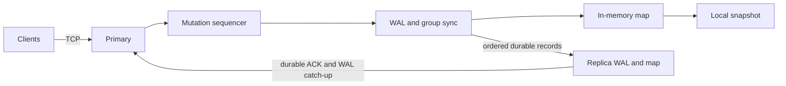

# DistributeDB

DistributeDB is a single-primary key-value database project for studying durable storage, crash recovery, concurrent TCP clients, and primary-replica replication. All eight phases of the Statement of Work are implemented and tested, along with its optional commands, transactions, and synchronous replication. It is a study system, not production ready.

## Status

Every phase of the [Statement of Work](docs/SOW.md) has an implementation and automated tests:

- **Storage:** an in-memory engine and an optional LSM tree, behind a checksummed write-ahead log (WAL) with group commit, snapshots, and process-restart recovery.
- **Serving:** a TCP client/server with `SET`, `GET`, `DELETE`, and `EXISTS`, plus the SOW's optional `SCAN`, `STATS`, `PING`, and `BEGIN`/`COMMIT`/`ROLLBACK`.
- **Replication:** an ordered primary-to-replica stream with durable replica ACKs, catch-up from retained WAL or an explicitly permitted snapshot, and optional synchronous acknowledgment.
- **Verification:** crash simulation, process kill/restart trials, a three-node Docker demonstration, and a benchmark harness with [published CI-runner results](benchmarks/results/README.md).

The [SOW conformance audit](docs/SOW-Conformance.md) maps each SOW section to its code and tests, and lists what remains out of scope.

The [technical design](docs/Technical-Design.md) describes the intended distributed behavior and marks choices added beyond the SOW. The [filesystem decision record](docs/ADR-001-Language-and-Filesystem.md) identifies the Linux/ext4 profile that durability claims rest on.

## Scope

The required key-value operations are `SET`, `GET`, `DELETE`, and `EXISTS`; `SCAN`, `STATS`, `PING`, and simple transactions are the SOW's optional extras. The core goals are persistent state through WAL and snapshots, concurrent client access, ordered primary-to-replica mutation delivery, replica catch-up after downtime, explicit durability and consistency semantics, failure tests, observability, and reproducible benchmarks.

The scope excludes SQL, distributed transactions, multi-primary consensus, Raft, automatic failover, sharding, production authentication, and encryption at rest. Transactions are single-node and per connection. The disk-aware index the SOW makes optional is an LSM tree, selected with `--storage lsm`; the in-memory map remains the default.

## Architecture



The server uses one mutation sequencer and a bounded write queue. In `fsync` mode, a write is appended with a group footer, synced, and applied before the server returns `OK`. Reads use the current applied map. The sequencer releases the database lock while a group syncs, so reads do not wait for a WAL flush; see the [performance analysis](docs/performance.md) for the measured effect. The local in-memory REPL does not persist data.

Replication sends only locally durable records. By default it is asynchronous: a primary `OK` means **local** durability, not replica durability. A disconnected replica may lag. If a connection drops before a client receives `OK`, the write outcome is unknown and the client must reconcile before retrying an operation whose repetition matters. A replica behind the retained WAL can install a snapshot only if it was explicitly provisioned to permit rebootstrap; see [replication and recovery](docs/replication.md) for limits.

### Asynchronous versus synchronous replication

Replication is asynchronous by default. Start the primary with `--sync-replicas N` for synchronous acknowledgment (SOW §11). The two modes differ in what an `OK` promises:

| | Asynchronous (default) | Synchronous (`--sync-replicas N`) |
|---|---|---|
| When the client gets `OK` | After the primary's own WAL group is synced and applied | After *N* replicas have also synced and applied the record |
| Acknowledged write survives loss of the primary's disk | Only if replication had already delivered it | Yes, if an acknowledging replica survives |
| Write latency | One local sync | One local sync plus a network round trip and the replica's sync |
| Primary with too few reachable replicas | Keeps accepting writes; replicas catch up later | Each write waits up to `--sync-timeout-ms` (default 1000), then answers `UNAVAILABLE` |

In synchronous mode, `UNAVAILABLE` after the timeout is an unknown outcome, not a rollback. The write is already durable on the primary, stays visible there, and reaches replicas when they reconnect. A client must treat it like a lost response and reconcile before retrying. `STATS` reports `sync_replicas` and `sync_ack_timeouts_total`. Waiting happens in the connection's worker with no lock held, so other clients' groups keep committing.

Asynchronous mode therefore leaves a window of acknowledged writes that exist only on the primary. A connected replica's sampled lag in `STATS` estimates that window in log entries; disconnected lag is unknown. After a replica restart or network gap, it can catch up from retained WAL. If the required prefix has been reclaimed, catch-up requires an explicitly permitted snapshot rebootstrap. Losing or destroying the primary's storage before catch-up can lose writes in the window. A process restart with intact primary storage recovers acknowledged local writes from its WAL.

Synchronous acknowledgment closes that window at the cost of latency and availability. On its own it does not give safe automatic failover. That also needs a commit protocol, fencing of a stale primary, and an election (SOW §24 stretch goals; [technical design](docs/Technical-Design.md) §8). For the cost of the asynchronous stream itself, compare the one- and two-replica rows with the single-primary `fsync` rows in the [published benchmark results](benchmarks/results/README.md).

## Run the current server

Use Rust 1.92 or newer on the [supported filesystem profile](docs/ADR-001-Language-and-Filesystem.md). The test suite also runs on Windows, which is not a validated durability profile. Each server needs its own data directory. The demo listener is unauthenticated and should remain on loopback.

```sh
cargo build --offline
cargo test --offline --all-targets
cargo run -- serve --addr 127.0.0.1:5555 --replication-addr 127.0.0.1:5556 --data ./data/primary
```

In another terminal:

```sh
printf 'SET user:123 Aaron\nGET user:123\n' | cargo run -- client --addr 127.0.0.1:5555
```

For binary keys and values, add `--hex` and encode each byte as two hexadecimal digits. In this mode, `GET` and `SCAN` values are printed in hex; `-` means an empty `SET` value or empty `SCAN` value. `NOT_FOUND` remains distinct from an empty `GET` result. For example, this writes and reads a key containing a zero byte and a value containing a newline:

```sh
printf 'SET 6b00 0a\nGET 6b00\n' | cargo run -- client --addr 127.0.0.1:5555 --hex
```

`SCAN start end limit` lists up to `limit` keys from `start` (inclusive) to `end` (exclusive) in key order, with `*` for an open bound. For example, `SCAN user: user; 100` lists `user:` keys. A trailing `(more)` means more keys remain; continue from just after the last key shown.

`PING` prints `PONG` when the server is reachable, and `STATS` prints its [statistics](docs/observability.md) as `name=value` lines.

`BEGIN` starts a transaction on the connection. Each `SET` and `DELETE` then prints `QUEUED`, and `COMMIT` applies them all at once as one durable group, or none of them if it fails. `ROLLBACK` discards them. A transaction holds at most 64 writes; see the [protocol notes](docs/Technical-Design.md) for isolation and limits.

`serve` takes optional flags:

- `--storage lsm` keeps data in the LSM tree instead of the in-memory map. The choice is recorded in the data directory.
- `--sync-replicas N` makes each write wait for *N* replica ACKs, with `--sync-timeout-ms` as the limit (see above).
- `--durability os` skips the WAL sync. It is for benchmarks only, and disables replication.

The `serve` process exits after `shutdown` on stdin or EOF. Run `cargo run` without a subcommand for the original **in-memory** REPL. A stopped primary can publish a snapshot with `cargo run -- snapshot --data ./data/primary`; see [snapshot operations](docs/snapshot-operations.md) for the locking and downtime requirements. Automatic scheduling is not implemented.

For a local replica, copy the `cluster_id` printed by the primary at startup and start a separate process and data directory:

```sh
cargo run -- replica --primary-addr 127.0.0.1:5556 --cluster-id CLUSTER_ID --data ./data/replica-1 --allow-snapshot-rebootstrap
```

Use the same command with another directory for a second replica. The replication listener is bound to loopback and has no authentication. Add `--read-addr 127.0.0.1:5557` to a replica command to expose optional eventually consistent reads on that port; writes sent there return `NOT_PRIMARY`.

For a reproducible three-node Docker demo, use [the local cluster guide](docs/docker-cluster.md). It includes startup, replica read checks, catch-up, and restart commands, plus `scripts/demo.sh`, which runs the full SOW §26 demonstration.

## Roadmap and verification

| Phase | State |
|---|---|
| 1 — Local key-value engine | Implemented and tested. |
| 2 — Persistent WAL | Implemented with group commit, checksums, simulated power-loss tests, and restart tests. |
| 3 — Networking | TCP server/client and concurrent request tests implemented. |
| 4 — Snapshots | Local publication, reload validation, WAL reclamation, and recovery tests implemented. |
| 5 — Replication | Static identity, ordered stream, durable ACKs, and connected replica lag implemented; integration tests cover two replicas. |
| 6 — Failure recovery | WAL reconnect, explicit snapshot catch-up, recovery-generation garbage collection, and a process kill/restart test implemented. |
| 7 — Performance engineering | Benchmark harness, published results, lock-contention metrics, and a measured lock-scope change ([analysis](docs/performance.md)) implemented. |
| 8 — Advanced storage | LSM tree engine (memtable, SSTables, background flush and two-level compaction) selectable with `--storage lsm`, with crash, replication, and server tests and a [comparison with the in-memory engine](docs/lsm.md). |
| Optional SOW features | `SCAN`, `STATS`, `PING`, and binary-safe `--hex` CLI input; per-connection transactions committed as one WAL group (§15); semi-synchronous replication with `--sync-replicas` (§11). |

CI runs formatting, Clippy, Rust tests, and documentation checks. Passing these checks supports the tested scenarios; it does not prove power-loss durability on physical hardware. The workload mixes are 90/10, 50/50, and 10/90 GET/SET; [published results](benchmarks/results/README.md) come from a shared CI runner and are for comparing revisions, not a hardware performance claim.

See the [SOW conformance audit](docs/SOW-Conformance.md), [development setup](docs/Development-Setup.md), [recovery notes](docs/recovery.md), [failure testing](docs/failure-testing.md), [benchmark method](docs/benchmarks.md), [`STATS` fields](docs/observability.md), [performance analysis](docs/performance.md), and the [LSM storage engine](docs/lsm.md) for test and operator details.

## License

MIT; see [LICENSE](LICENSE).
